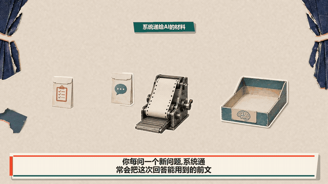
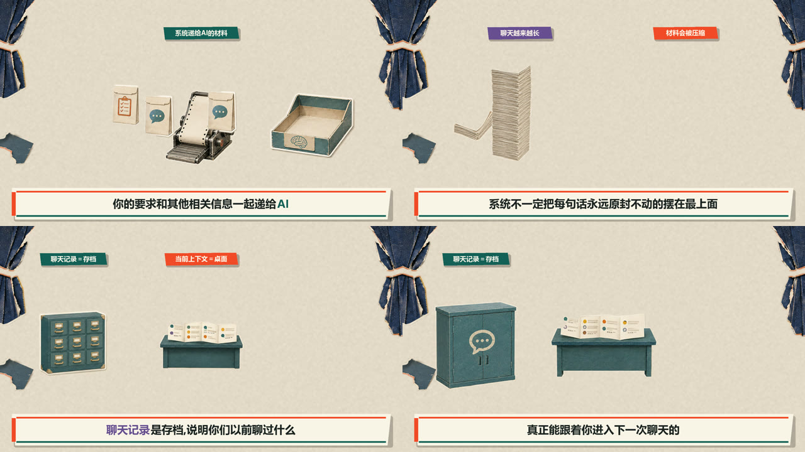
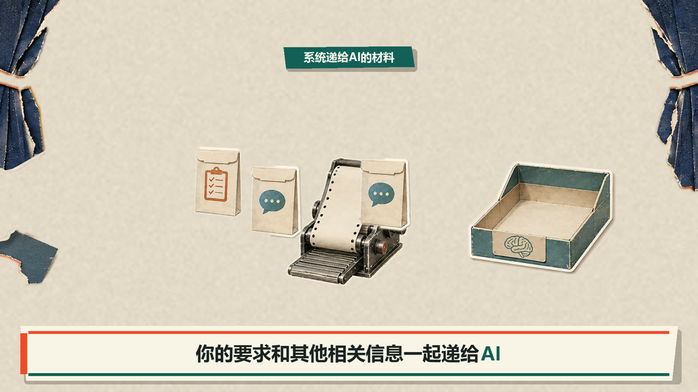
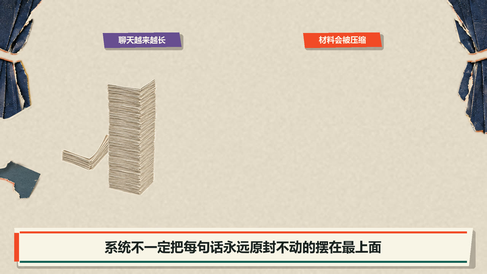
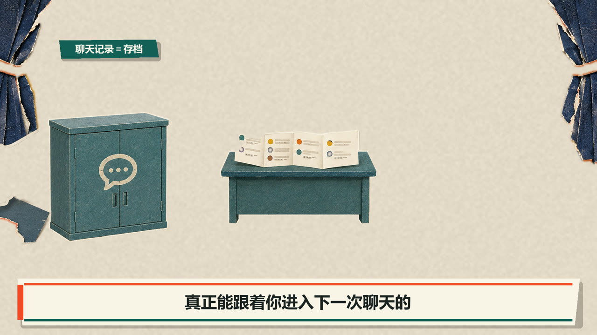

# Audio-Locked Paper Theatre

一套面向 60 秒以上口播科普视频的 Agent Skill 与可执行门禁，没有 240 秒硬上限：先锁定真实口播，再用固定纸艺剧场、独立视觉素材和确定性后期，让画面逐件登台并与每一句解释严格对齐。V1.3 新增亮色纸艺呈现、语义圈选、背景音乐来源、运行环境与仓库身份四组结构化门禁。更长的视频继续按自然章节扩展，同时按总时长增加审核帧和高密区抽查数量。

它可安装为 Codex Skill，也可由其他具备文件读写、Python/Node 命令执行能力的 Agent 使用。内置生图能让素材生成自动化；没有生图工具时，改用用户提供素材或合法本地素材库，后续排版、渲染和质检仍可继续。详见 [运行环境兼容说明](references/runtime-compatibility.md)。

它解决的不是“如何给一张拼贴图加慢速推拉”，而是长篇不露脸科普最容易失败的几个地方：

- 口播、字幕和画面时间线错位
- 一张整景撑太久，或者一句话乱切很多镜头
- 画面素材不够，后半段明显偷懒
- 圈线圈错对象，标签和图层互相遮挡
- 只凭坐标放圈，实际高亮了相邻按钮或错误道具
- 放大后使用镜像/反射补边，边缘出现重复幕布或半截主体
- 转语音 SRT 丢失中文标点，生成语音连续朗读
- 前 40 秒通过后，完整版没有重新审核
- 3:4 与 4:3 封面由同一张图机械裁切
- 扫描光实际扫到放大镜、外壳或背景
- 图片没有真正进入机器，结果却从无关位置出现
- 三个并排图标被误当成同一对象的三层剖面
- 画面有声音才看得懂，静音时无法判断谁对谁做了什么
- 声称沿用旧 BGM，实际使用了另一首相似音乐
- 结尾展示 Skill 或仓库时，名称、URL 被截断、拼错或被前景挡住

## 效果预览

下面是从一条已通过审核的完整纸艺科普成片中，抽取并压缩得到的 **16 秒无声演示**。它只展示固定舞台、独立素材登台、字幕栏、语义标签和场景切换，不包含原口播、BGM、品牌尾片或完整节目内容。



[▶ 打开更清晰的 720p MP4 演示](media/paper-theatre-silent-demo.mp4)

四个代表场景：系统材料进入、长上下文压缩、聊天记录与当前上下文分离、存档与当前桌面切换。



| 固定舞台与独立素材 | 长上下文压缩 |
| --- | --- |
|  |  |
| 聊天记录与当前上下文 | 存档回到当前上下文 |
|  |  |

## 核心流程

```text
初稿
→ 第二模型做事实、结构、小白表达和口语优化
→ 人工锁稿
→ 带标点、带时间码的 TTS SRT
→ 返回真实口播
→ 单独生成与真实口播同步的屏幕字幕 SRT
→ 逐句画面映射＋独立素材清单＋图层合同
→ 前40秒高风险证明样片
→ 几何、边缘、容器居中、旧错回归与独立复核
→ 用户确认表现机制后直接完成整篇（制作端内部按45–60秒自然章节施工，不逐章打断）
→ 全片从0秒重新审核
→ 独立生成3:4与4:3封面
→ 完整视频＋字幕＋封面＋发布包＋QA＋哈希
```

## 这套方法的关键观点

1. **真实口播是唯一主时间轴。** 不能在制作端擅自变速、收紧停顿或让 BGM 决定剪辑点。
2. **固定舞台，移动语义对象。** 禁止用整画面慢推、呼吸缩放和微漂移冒充丰富动画。
3. **一幕讲清一个完整意思。** 让对象按“进入 → 互动 → 可见后果 → 停稳”表演。
4. **主要对象必须独立。** 截图裁块、一个扁平整景和简单换色不计入素材密度。
5. **精确元素由确定性后期负责。** 中文、字幕、圈线、箭头、遮罩、图层和运动轨迹不交给生成模型碰运气。
6. **前40秒只证明机制。** 完整版必须重新执行全部门禁。
7. **候选、发布和市场验证是三种状态。** 本地通过不等于已经发布，更不等于有市场效果。
8. **时长没有240秒上限。** 超长内容仍由真实口播决定；独立素材、原尺寸抽帧和高密区检查随时长同比增加。
9. **动作必须有明确对象和后果。** 每个口播单元登记动作者、目标、动作、结果、结束状态和禁止误读。
10. **机器关系必须真实。** 插槽用硬遮罩，扫描轨迹不能离开目标，输出必须从登记的机器出口产生。
11. **三层来自一个源对象。** 所有展开层共享同一个 `source_id`，静音时也能看出它们从哪里产生。
12. **圈线也必须绑定语义目标。** 圈、箭头、聚光和放大提示登记目标、实测中心与误差，不能凭目测贴近。
13. **BGM 是可追溯资产。** 记录来源、SHA-256、混音增益与听感复核；“沿用上一首”必须哈希一致。
14. **运行能力可以降级。** 有内置生图时自动生成新素材；没有生图时使用用户素材或合法本地素材库，不伪造生成结果。

## 仓库内容

```text
SKILL.md                         Codex Skill 入口
references/workflow.md           完整长片工作流
assets/episode-template.json     生产账本模板
assets/*-template.json           动作、对象、遮挡、静音审核与镜头来源模板
scripts/validate_episode.py      分阶段结构验证器
examples/retest-prompts.md       正向与反向行为测试
tests/test_validator.py          验证器回归测试
media/                           无声演示视频、GIF 与代表帧
references/sources-and-license-boundary.md  外部方法来源与许可边界
references/bright-papercraft-presentation.md  亮色纸艺呈现、文字与语义圈选规则
references/runtime-compatibility.md  Codex与其他Agent的能力要求和无生图回退
```

## 安装与兼容性

将仓库克隆到 Codex Skills 目录：

```bash
git clone https://github.com/jay-yangPY/audio-locked-paper-theatre.git ~/.codex/skills/audio-locked-paper-theatre
```

Windows PowerShell 示例：

```powershell
git clone https://github.com/jay-yangPY/audio-locked-paper-theatre.git "$env:USERPROFILE\.codex\skills\audio-locked-paper-theatre"
```

也可以只使用模板和验证器，不安装为 Skill。

完整自动化建议具备：文件读写、Python 3.10+、Node.js、Remotion、FFmpeg，以及一个可调用的生图工具。生图工具不是验证器和剪辑流程的硬依赖；缺少它时使用 `user_supplied` 或 `local_library` 资产模式。

## 快速开始

复制生产账本：

```bash
cp assets/episode-template.json /path/to/project/episode.json
```

按阶段验证：

```bash
python scripts/validate_episode.py /path/to/project/episode.json --stage plan
python scripts/validate_episode.py /path/to/project/episode.json --stage script
python scripts/validate_episode.py /path/to/project/episode.json --stage audio
python scripts/validate_episode.py /path/to/project/episode.json --stage front40
python scripts/validate_episode.py /path/to/project/episode.json --stage final
python scripts/validate_episode.py /path/to/project/episode.json --stage deliver
```

运行测试：

```bash
python -m unittest discover -s tests -v
```

## 门禁边界

验证器负责检查生产账本、SRT、文件存在性、阶段状态、封面比例、动作对象、扫描边界、输出来源、同源分层、静音审核和关键审核回执。它不会判断画面是否好看，也不会自动证明圈线真的圈准、光学居中真的舒服或人物手指没有穿帮。

因此正式交付仍需要：

- 每 0.1 秒的全对象几何扫描
- 全部语义圈线逐项核对
- 四边画布回归检查
- 原尺寸帧与高密区放大检查
- 容器几何居中与最终像素光学居中检查
- 完整视频解码
- 与制作端分离的独立复核

## 不包含什么

- 不包含完整成片、私人口播、BGM、品牌 Logo 或可复用的节目源素材；`media/` 只保存文档用的压缩无声示例
- 不自动登录、付费、提交视频生成任务或发布到平台
- 不复制 Vox 的 Logo、字体、具体画面或商业包装；这里只保留通用的编辑部纸艺解释语法
- 不保证播放量、完播率或商业结果

## License

MIT
